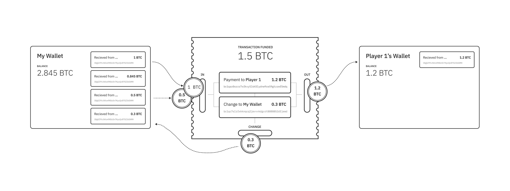
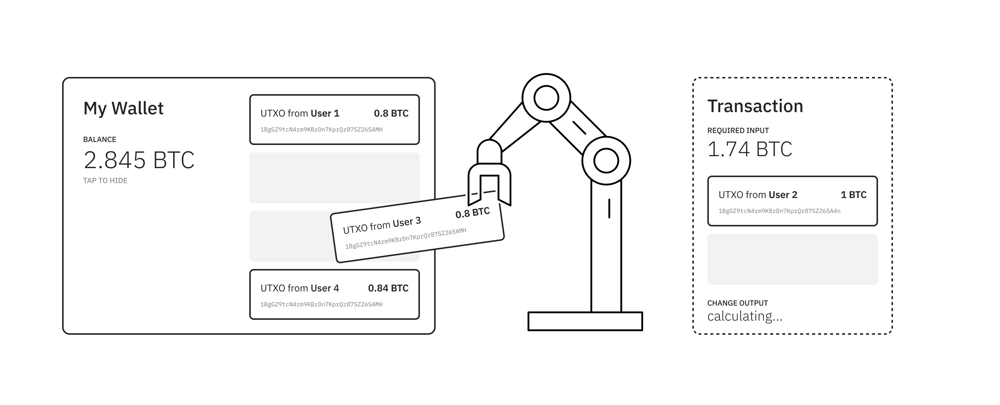
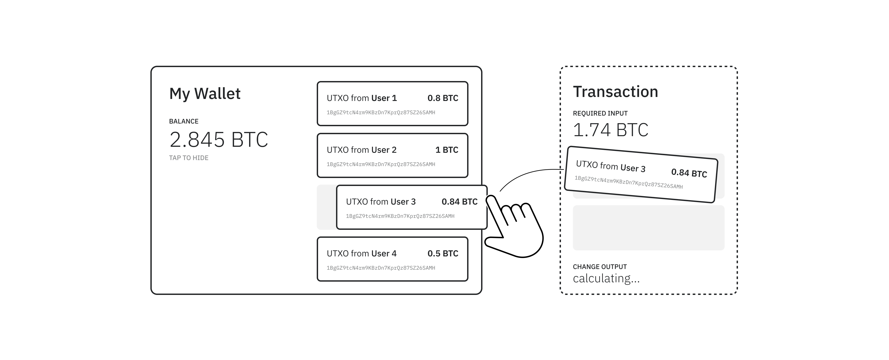



# Coin Selection

To understand coin selection, you should have already read up on [UTXOs](/glossary#utxo).

Coin selection is the process of choosing which UTXOs to fund a bitcoin transaction with (i.e the transaction's inputs)[^1] when making an on-blockchain payment. Since your wallet contains multiple fractions of bitcoin to arrive at a balance, these fractions are retrieved by an algorithm to fulfill the payment amount.

There are two categories of coin selection strategies that are used in bitcoin applications:

1. Automatic Coin Selection (wallet is delegated to control coin selection)
2. Manual Coin Selection (user controls coin selection)

The user may be also motivated to optimise for three different reasons:
1. Optimising for Cost
2. Optimising for Speed
3. Optimising for Privacy

## Hard Contraints and Goals with Coin Selection
Before exploring some popular coin selection strategies, it is worth noting the following hard constraints when making a bitcoin payment in relation to UTXOs.

#### Constraints

- The transaction must have sufficient funding
    - In order to send X, the transaction inputs must at least equate to X.
- Blockspace and Fees
    - As blockspace is limited, miners prioritise transactions by *fee per byte* to maximise revenue
    - Transactions must be accompanied by the minimum relay fee for confirmation (therefore inputs must equal X + fee).
- No Dust
    - Transactions that create dust outputs are not relayed and confirmed by most nodes and miners in the network.

#### Goals

- Minimising Cost
    - Miners select transactions on the basis of their fee per data size (satoshi per byte). Therefore, it is cost effective for users to minimize transaction size. 
- Increasing TX Speed
    - Higher fees will increase the likelihood of your transaction being prioritised by miners and included in the next block.
- Retaining Privacy
    - Avoiding merging UTXOs to reduce balance exposure and economic activity to trading partners.

## Enter an amount and let the application choose

An automatic coin selection strategy used in bitcoin wallets allows the application to select which coins to make a payment with on your behalf. As mentioned above, "fractions (of bitcoins) are retrieved by an algorithm to fulfill the payment amount". The algorithm used varies from wallet to wallet, and is dependent upon the desired outcome of optimisation (mentioned above).

Whilst this strategy may not always be optimal, it can provide the most frictionless user experience and is therefore employed by most introductory level bitcoin wallets.

### How it works
A user chooses to send a payment to one of their contacts. They enter the amount of bitcoin they wish to send, select their transaction fee rate, and approves the outgoing payment request. 

A few popular algorithms currently implemented by bitcoin wallets:

##### Algorithms Optimising for Cost / Speed
- **First In First Out (FIFO):**  <small>The default strategy spends the oldest coins first.</small>
- **Last In First Out (LIFO):**  <small>This strategy spends newest coins first.</small>
- **Pruned FIFO:**  <small>Similiar to FIFO, but smallest UTXOs filtered out in post-selection step.</small>
- **High Priority First:**  <small>Coins selected by priority (calculated by value x age). Up until February 2016, a portion of each block (50kB) was reserved for high-priority transactions by default. This algorithm therefore optimised for transaction speed.</small>
- **Minimize Fees (Optimize Size):**  <small>Spending the lowest number of coins to reduce the byte size of the transaction, resulting in a low network fee.</small>
- **Minimize Future Fees (Merge Coins):**  <small>The strategy spends the maximum number of inputs so that a potential price rise does not make smaller coins economically unspendable. Indeed, if the price of a crypto asset increases too much, smaller coins may worth less than the cost of the network fees to spend them.</small>

##### Algorithms Optimising for Privacy (No Change)
- **Target Sized Change**  <small>Wallet aims to minimize the value difference of target input and change output.</small>
- **Branch & Bound (BnB)/Exact Change**  <small>Wallet finds an input set that is equal in value to the target, avoiding change outputs. If the wallet cannot find an exact match, it refers back to a "knapsack" solver which selects inputs that minimise the change output to within 0.01 BTC.</small>
- **Blackjack:**   <small>Accumulates inputs until the target value (+fees) is matched, does not accumulate inputs that go over the target value (within a threshold).</small>
- **Accumulative:**  <small>Accumulates inputs until the target value (+fees) is reached, skipping detrimental inputs.</small>

#### Pros
- Low friction: easy for end user, doesn't have to play around with manual coin selection (often an overwhelming process).
- Wallets can choose to optimise for cost, speed, or privacy (byte size of transaction, fee, change outputs) depending upon their targeted user group.
- Minimising change outputs decreases balance exposure (e.g BnB or Target Sized Change) and chance of tracing future transactions from that address.

#### Cons
- These strategies do not optimise for all 3 features (speed, cost, privacy), and more often than not privacy is the first to be sacrificed
- Solutions optimising for speed/cost:
    - UTXOs selected from unrecognised clusters can expose private data of wallet addresses, balances, and contact payment information (UTXO derivation paths and data).
    - Reducing byte size of bitcoin transactions doesn't optimise for minimal change outputs, exposing larger amounts of sensitive wallet data.
    - Standard network (relay) fees are usually so high that sacrificing privacy comes at little gain.
    - With the introduction of the Lightning Network, these solutions provide little gain for a decrease in privacy protection.
- Solutions that do optimise for minimal change outputs ("privacy"):
    - Can require strenuous computational power (BnB).
    - Smaller/no change outputs are not guaranteed and is often dependent upon wallets having a large variation of UTXOs.
    - Can lead to UTXOs being selected across multiple clusters, exposing same sensitive information.
    - Arguably, these solutions are "better than no privacy", but in reality are by no means a silver bullet.

### Best practice

#### When to use
- New Users or introductory wallets
- Wallets that wish to prioritise cost or transaction speed
- Wallets that wish to prioritise privacy in automatic coin selection (BnB or Target Size Change)

#### When not to use
- When privacy is a top priority to users

#### Products that use this scheme
- Bread Wallet + Electrum (FIFO)
- Mycelium (Pruned FIFO)
- BitcoinJ and Bitcoin Wallet for Android (High Priority First)
- Electrum *Private Mode (Target Sized Change)
- Bitcoin Core (Branch and Bound)
- Hexa (Blackjack, with Accumulative Fallback)

## White/Black listing targeted coins and clusters

Whilst employing automatic coin selection algorithms such as Branch and Bound or FIFO, some bitcoin wallets/libraries (such as bitcoindevkit/bdk) allow for users to opt for *some* form of coin control when selecting transaction inputs. Users can opt to white/black list certain coins or clusters from their wallet's UTXO pool to either prioritise or avoid using when funding outgoing payment requests. 

This semi-manual strategy gives users the ability to take some form of coin control, whilst not having to undergo an often tiring process of manually selecting transaction inputs. Good labelling of UTXOs and contacts gives users a much clearer idea of which coins or clusters they might wish to white/black list.

### How it Works

Either prior to, or during a transaction, users can choose certain coins or clusters (contact's coins) to become prioritised or ignored by the wallet's automatic coin selection algorithm when selecting transaction inputs. 

#### Pros

- With good labelling, users can avoid using certain coins or clusters when sending payments.
- Gives the user manual control over UTXO white/black listing.
- Allows for some form of privacy control whilst also allowing the wallet to further optimise for cost, speed, or privacy (depending on the wallet's automatic selection algorithm).
- Optimised if users practise good UTXO labelling and contact creation.

#### Cons 

- Does not give full control over coin selection.
- White/black listing certain coins may hinder the wallet's automatic algorithm's ability to optimise for speed, cost, or privacy.
- Process of white/black listing certain UTXOs in advance is arguably a clunky user experience.

### Best Practise

#### When to Use 

- When wanting to give users some form of control without asking them to rely on fully manual coin selection.
- When users want to avoid using specific coins or clusters.
- This solution is optimised if users have control over contact creation and UTXO labelling.

#### When not to Use

- When users wish to opt for full coin control (manual UTXO selection)

#### Products that use this scheme

- Bitcoindevkit/bdk Library

## Manual Coin Selection (aka Coin Control)

This strategy of manual coin selection gives users full control over exactly which coins or clusters they use to fund a transaction input for an outgoing payment request. 

Manual coin control is often an "opt-in" strategy, agreed to by users as they enter "Private Mode" or select "Manual Coin Selection" when creating an outgoing payment request. However, it is also possible for bitcoin wallets to use manual coin control as their default coin selection strategy.

Manual coin control also gives users the ability to choose for themselves what they optimise for in their bitcoin transactions (cost, speed, or privacy). However, it's worth noting that manual coin control, whilst beneficial to many users, could also lead to expensive, slow, or revealing if used incorrectly. Manual coin selection is an advanced feature and should be used (and designed) with caution. 

### How it works

A user chooses to send a payment to one of their contacts. They enter the amount of bitcoin they wish to send, select their transaction fee rate, "opt-in" for manual coin selection (or by default), select which UTXOs will fund the transaction input, and finally approve the outgoing payment request.

#### Pros

- Gives user full control over coin selection. They can choose to optimise for privacy, cost, or speed, and delegate risk accordingly.
- Good labelling of coins allows users to prioritise recognised clusters, thereby minimising address and balance exposure
- Has potential to reduce dust attacks (avoiding choosing minute UTXOs for payment inputs)

#### Cons

- Can be a lengthy, often confusing process (particularly for inexperienced users)
- Can lead to dust attacks if not careful selecting sizes of UTXO inputs
- Bad labelling of contacts and clusters can lead to sensitive information being exposed

### Best Practise

#### When to Use

- When wanting to optimise for privacy
- When wanting to give users full control of selecting transaction inputs
- Wallets used by privacy oriented/advanced bitcoiners

#### When Not to Use

- Introductory level bitcoin wallets 
- If privacy is of no concern

#### Products that use this scheme

- Bitcoin Core
- Wasabi
- Samourai
- BTCPay

## Coin Selection & Privacy

Because each UTXO can be traced backwards on a public ledger, we can unearth the digital footprints of bitcoin payments, potentially exposing the private data of senders, receivers, and their various wallet balances along the way. Coin selection, whether an automated or manual process, will most likely result in some breach of sensitive information for both you as well as your previous payers and payees.

### The Challenge for Designers 

The questions designers and developers are faced with are: how much privacy to we want to inherently bake into our wallet's payments? How do we inform wallet users of privacy risks when sending and receiving payments (if at all)? 

[^1]: https://coincentral.com/what-is-coin-selection-and-why-does-it-matter/
[^2]: https://www.investopedia.com/terms/u/utxo.asp
[^3]: https://support.ledger.com/hc/en-us/articles/360015996580-Using-Coin-control#:~:text=Before%20this%20new%20feature%2C%20all,to%20fulfill%20the%20transaction%20amount.
[^4]: https://www.reddit.com/r/WasabiWallet/comments/eb1zzo/the_importance_of_good_labels/

