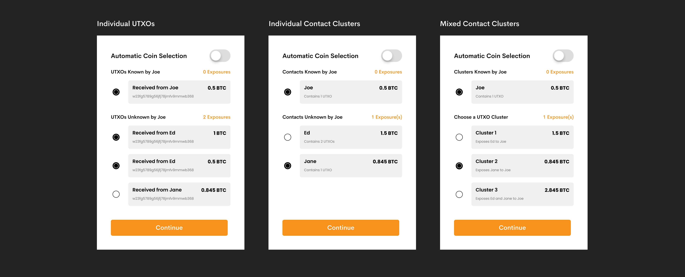

# Coin Selection

## Intro

Coin selection is the process of choosing which of your Bitcoins to spend when creating and approving a spending transaction. To understand coin selection a little better, one must first have a decent knowledge of Unspent Transaction Outputs (UTXOs), the amount of digital currency remaining after a bitcoin transaction has been executed.

How does this relate to coin selection, you might ask? Because UTXOs allow for transactions to be conducted using miltiple fractions of bitcoin that do not all come from a single previous transaction. Instead, multiple fractions of bitcoin are retrieved by the algorithm to fulfill a spending request. For example, an outward transaction of 1.2 BTC may retrieve UTXOs worth 1 BTC and 0.5 BTC from a users wallet. Change (0.3 BTC) from this transaction is then sent back to the senders address in the form of one of more UTXOs.

Coin selection, therefore, is the choosing of which UTXOs to fund a bitcoin transaction with (i.e the transaction's inputs). 

## A Privacy Risk

Because each UTXO can be traced back on a public ledger to it's newly minted state (a whole bitcoin), we can unearth the digital footprints of bitcoin payments, potentially exposing the private data of senders, receivers, and their various wallet balances along the way (imagine a Russian doll that becomes fragmented into smaller and smaller pieces, contaminating itself with private data along the way). Coin selection, whether an automated or manual process, will most likely result in the breach of privacy for both you as well as your previous senders of bitcoin. However, there are various ways of mitigating how much data is exposed during each transaction. We can reduce this security risk in a few different ways, however, we are left with a design challenge.

How do we account for coin selection within a user flow of creating a bitcoin transaction, whilst minimising the risk of a privacy breach? 

### Scenario

`A user wants to make a payment of 0.6 BTC to their friend Joe and reveal the least amount of information about the bitcoin they own, and (ideally) they want it to be cheap. It is not an urgent payment.`

The user's wallet currently has a balance of **2.845 BTC**, and is comprised of 4 UTXOs:

- 1 BTC from Ed
- 0.5 BTC from Ed
- 0.845 BTC from Jane
- 0.5 from Joe

These UTXOs can also be grouped into "clusters" from the individual senders (see diagram). 

#### The Transaction

Ideally, we want to expose the least amount of information possible to Joe, so it makes sense to use the 0.5 BTC (UTXO) originating from his address, as this does not comprimise anyone else's privacy. In an ideal scenario, Joe's cluster contains enough bitcoin to fund the entire transaction request (0.6 BTC), however, in this case it does not. 

The user (or their wallet) must therefore select additional coins to fund the transaction (equalling 0.1 BTC or more), thereby partially exposing coins from another cluster, and the address and balance data of contacts unrecognised by Joe (e.g Ed or Jane).  *Note: we could of course use a single UTXO not originating from Joe's address (e.g 0.845 BTC from Jane) to fund the transaction, however, this would be a sure way of exposing Jane's address to Joe and should be avoided if possible.*

This additional 0.1 BTC could be funded in multiple different ways:

- **Option 1:**
    - 0.5 BTC from Joe
    - 0.845 BTC from Jane
    - Total Output: 1.345 BTC (0.745 BTC change)
    - Exposes: Jane to Joe
- **Option 2:** 
    - 0.5 BTC from Joe
    - 0.5 BTC from Ed
    - Total Output: 1 BTC (0.4 BTC change)
    - Exposes: Ed to Joe
- **Option 3:**
    - 0.5 BTC from Joe
    - 1 BTC from Ed
    - Total Output: 1.5 BTC (0.9 BTC change)
    - Exposes: Ed to Joe

### The Challenge for Designers 

In each of these scenarios, I am exposing the data of each previous UTXO owner. So the first question we are faced with is, how many people should we expose to Joe? However, we are also faced with the issue of exposing how much BTC we own to Joe. In option 1, Patrick knows I own *at least* 1.345 BTC. In option 2, 1 BTC. And in Option 3, 1.5 BTC. This is another consideration to take into account when selecting coins.

The questions designers and developers are faced with are: how much privacy to we want to inherently bake into our wallets payments? Do we want users to have manual selection over which coins they use to fund a transaction? Should this be an automated process? Finally, and perhaps most importantly, how do we translate this privacy risk to the user through the UI?

### Solutions

#### Current Solution (Optimising for Fees)

#### Proposed Solution (Optimising for Privacy)

The ideal privacy oriented solution would be for wallets to automatically select (a cluster of) coins to send from the payee's recognised address (e.g Joe), thereby minimising privacy exposure. However, if the coins selected do not total the amount required for the transaction input, the wallet provider gives you the option to use either automatic or manual coin selection.

##### 1. Automatic Coin Selection

The first option is to use an automatic coin selection which prioritises a payee's cluster of UTXOs (e.g Joe's). However, this is idealised and reliant upon the cluster containing enough bitcoin to fund the payment request.

If the payee's cluster does not contain enough bitcoin, the wallet could automatically select other coins to send. It would be the wallet provider's responsibility to show that there is some level of risk being taken, and that privacy is being comprimised. *Which might then prompt...*

##### 2. Manual Coin Selection

If a wallet owner wants to manually mitigate their own privacy risks (or those of others), they could manually select exactly which UTXOs they wish to fund the payment request with. This would need to total the input request (e.g 0.6 BTC), otherwise the transaction would fail. Ideally, the sender would be able to see which contacts/addresses would be exposed, and they can then select coins accordingly. 

Coin information could either be displayed by:

**a). Individual UTXOs** 

- Giving users full control over which exact coins they can select from. This might be multiple UTXOs from one contact, or a mixture of multiple contacts. This solution might be best in optimising for privacy when it comes to balance exposure, however, might also lead to more contacts becoming exposed to the payee.

**b). UTXO Clusters** 

- This gives user control over which coins to send based on a variety of cluster options. Cluster options could be shown by either:
  - x). Individual Contact Clusters - *minimising multiple contact exposures if possible, as well as enabling more control over balance exposure.*
  - y). Mixed Contact Clusters - *based on the input required (using 1 or more contact's UTXOs), informing the sender of which contacts would become exposed to the payee. This option does not give as much control over balance exposure.*

...

#### Proposed User Flow

1. Create a payment

2. Choose who you are sending bitcoin to (Output)

3. Choose how much you are sending (Amount)

4. Wallet automatically selects coins from a recognised cluster (if coins have previously been received from this address)

   *If selected cluster/coins is not enough to fund transaction...* 

5. Select which additional coins to send. Optimising for:

   - Minimal address exposure (e.g exposing Ed and/or Jane)

   - Minimal balance exposure 

6. Sign & Broadcast transaction to Bitcoin network

...

#### References

https://coincentral.com/what-is-coin-selection-and-why-does-it-matter/

https://www.investopedia.com/terms/u/utxo.asp