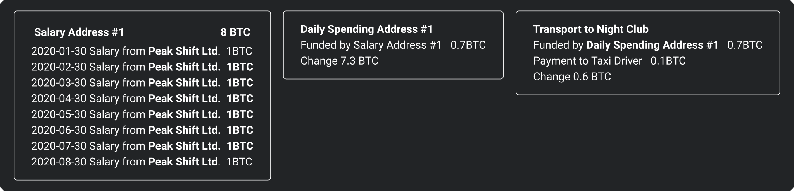
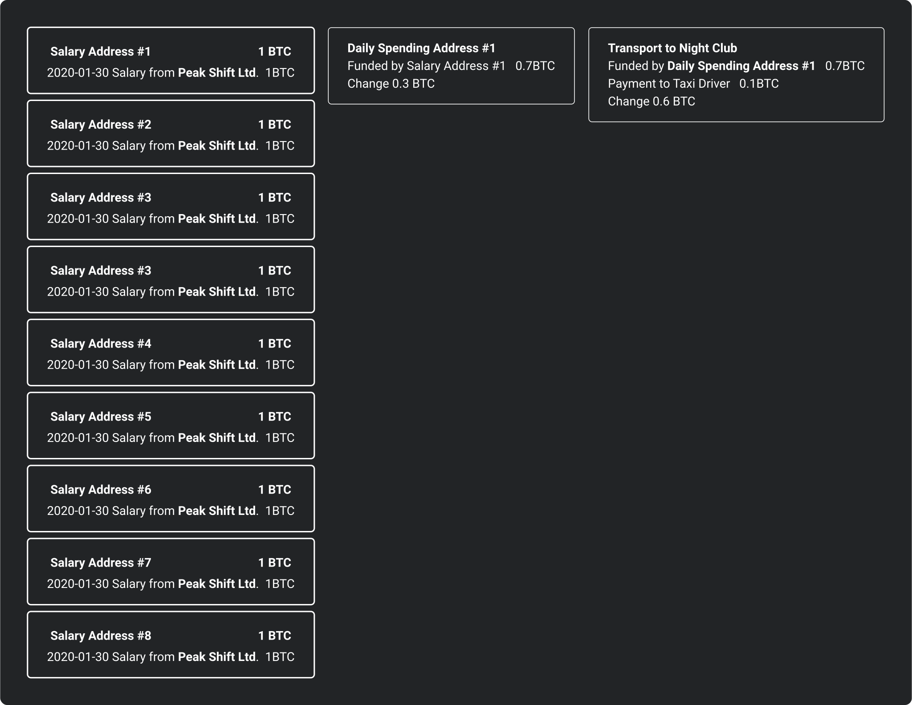



# Requesting Payments

**Payment Requests** hold the information a wallet requires to make a bitcoin payment. Whether you are making an On-chain or Lightning Payment the user flow is typically the same.

The receiver generates a payment request, shares it with the payer via some out-of-band method (QR code, text message, etc.), then the payer approves the payment in their wallet.

## Reusability

Lightning Payments are made by paying an invoice that uses the BOLT11 standard. It is only technically possible to pay a Lightning Invoice once and in the full amount.

On-chain the core of a payment request is an address. While not strictly enforced, you should recommend users only to use them once as all transactions are public. By receiving multiple payments to a single address leaks more information about the users' funds in future transactions.

## Expirations

This is effectively a time limit past which the invoice becomes invalid.

- BOLT11 spec states default is 3600 seconds 
  - Have not seen an application which allows expiration to be customised
  - Some implementations set it as 24 hours, and others diverge
- Merchant Payment Processors typically rely on expirations as a "protection mechanism against the volatility since it locks the cryptocurrency amount according to the bitcoin to fiat rates"[^4]
- Note: Even if on-chain payment requests expire it would still be possible to push a payment to the address as there is no way to enforce expirations.

## Persistance

When a payment request is created it should be stored in the app until it is fulfilled so the user does not acciedntly share the same address to multiple parties.

#### Implications to Restoring/Migrating to a different software

##### Lightning

- Since invoices are already stored on the users lightning node, when they connect to that node on a new device it will pull the invoices in.

##### On-chain

- https://blog.lopp.net/mind-the-bitcoin-address-gap/
- [account-scanning](./account-scanning.md)

## Sharing

If you share a payment request (address) with someone the natural assumption they would make is that you control the private keys to access the coins.

That person is then able to look up the address on a bitcoin blockchain explorer and see any transactions going to or from the address.

By sharing the same payment request (address) with another party you are receiving the payment from -- they will  be able to see the previous transactions including their new transaction to you.

If you share a new payment request (unused address), then they are only able to see the transcation to you. Once you spend the coins you received to that address they will also be able to see where they coins they sent you was spent.

### Given that you should always create a new payment request for each new payment. How might merchants or non profits create payment request on their websites? 

Most bitcoin wallets typically store a 12/24 word seed phrase that is able to generate billions of accounts which each further contain billions of address and their private keys.

In the past, with a basic wallet, you would generate pairs of private keys and public keys independently each time you wanted to receive some bitcoin.

This worked perfectly fine, but it meant you would need to back up your wallet every time you receive a new payment.[^1]

Seed phrases are easy to write down, even on a piece of paper and would back up all of these accounts.

#### Output Descriptors / xpub

While you should never ever share your seed phrase, or a private key for one of your accounts or addresses.

You can however share the address, or extended public key (xpub) for an account. Sharing an xpub should be done with caution though since if one of your private keys for any account or address is leaked you can result in losing all the funds in your wallet.

#### Use Cases

If you share an extended public key for one of your accounts with someone it is possible for them to generate billions of addresses without them ever being able to generate the private keys of those addresses or the private key for the account itself.

##### Online Shops

A merchant can enter an extended public key on their e-commerce software -- and every time a customer goes to checkout, a new address would be shown to them.

##### Employers

If you don't want to have to give a new address to your employer every 2 - 4 weeks for your salary, you can also share with them an xpub which they can use in their wallet to generate new addresses every time they have to pay your salary.

###### Address Reuse

*Why not just get your salary into one address?*

If you were to get your salary paid into just one address — then anytime you make a payment using funds from this address, you will be exposing all payments you received as salary.

###### What if I send a smaller amount from my daily spending wallet?

Even if you were to add hops between it would still be possible to determine your control of the larger amount of funds.

## Data Format / Presentation

A payment request should ideally be a BIP21 URI or BOLT11 lightning invoice with the `lightning:` URN. This piece of data can be represented in the following ways.

1. Encoded String
   1. Copy/Paste
2. QR Code
   1. For scanning
3. Web Link
   1. Deep linking

## Methods to transport a Payment Request

### At a distance (has contact information)

- Email
- SMS / Whatsapp
- Inside Payment App
- Phone

- Web Link (e.g. BTC Pay Server)

### At a distance (public)

- On Website
- Twitter

### Close Proximity (no contact exchange/contactless)

- NFC (Contactless Payment)
- [QR Code](./qr-codes.md)
- Print (invoice, flyer, menu)
- Sound Waves[^5]

### Close Proximity (setup required)

- Bluetooth

[^1]: https://learnmeabitcoin.com/technical/hd-wallets#single-backup "HD Wallets: Using a single seed to generate a tree of keys"
[^2]: https://learnmeabitcoin.com/technical/extended-keys "Extended Keys: Private keys and public keys that you can derive children from"
[^3]: https://blog.btcpayserver.org/payment-requests/
[^4]: https://docs.btcpayserver.org/FAQ/FAQ-Stores/#invoice-expires-if-the-full-amount-has-not-been-paid-after-minutes
[^5]: https://thenextweb.com/asia/2013/01/18/alipay-wallet/ "Money is transferred via the Internet, barcodes, QR codes and an interesting ‘sound wave payment’ technology
