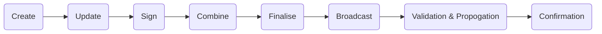



# Transactions

The bitcoin blockchain (on-chain) does not have a concept of accounts built-in. Since all on-chain transactions are public, bitcoin uses Unspent Transaction Outputs instead. Accounts would make it easy for anyone you transact with to find your entire balance and transaction history.

To make a payment on-chain, you need to create a transaction, fund it by selecting some previously received bitcoin then select the payment destination address and amount. If there is any remainder, you need to set a change destination address; otherwise, the miner will take anything remaining as the fee to confirm the transaction into a block.

On the receiving end, the person you are paying can see the UTXOs that you funded the transaction with if they choose to look it up in a [blockchain explorer](). They won't be able to see any of the other UTXOs in your wallet that you previously received.

Taking this scenario further — if the recipient needs to make a payment to someone else, they would create a transaction of their own and fund it with the UTXO you sent.

## Structure

A transaction is able to take multiple inputs (coins used to fund the transaction) and outputs (payments and the remaining change). So you can allow users to build a transaction that contains multiple payment operations. Enter, batched payments.

A batched transaction is a collection of payments that will all be sent out at the same time, effectivly in the same transaction. This has a potential for fee saving benefits, but is terrible for privacy as it makes it possible to link one identity with several payments on-chain.

Still we use batched transactions in this chapter as it make it easier to communicate the capabilities of an on-chain transaction.

---

#### [Creating a Transaction](#)

A transaction can be collaboratively built (for example joint accounts / multisig). In the scenario where the user may want to share a transaction with another party or another device for signing — the there is a file type bitcoin transactions use called PSBT. The transaction can be exported as a `.psbt` file and shared just as you would with a document.

You can think of a wallet as an interface for this file type — which in the end allows you to publish the transaction.

##### [Funding a transaction](#)

When transacting on the bitcoin blockchain (on-chain), you fund a transaction by selecting some previously received coins, then enter the payment destination and amount.

###### Unlocking funds

- Single Signature
- Multi-signature

---

##### [Adding Payments](#)

There can be multiple payments within a transaction — and all that is required by the user is to enter the destination address and the amount.

###### How do payments get added to a transaction?

- Manually entering address, amount and memo
- Subscription Manager automatically adds a payment to a transaction thats been scheduled.
- Selecting an unfullfilled payment request
- Selecting contact and entering the amount
- Scanning payment request
- Detect payment request in clip board.

###### Spending Conditions

- Multi-Signature

---

##### [Change](#)

If the amount of coins you funded the transaction with exceeds the amount you need for the payment there will be some change remaining. Your wallet would generate a new change address in the background where the remaining bitcoin would be sent.

It's also possible for you to allow the user to choose where this change goes (for example to a payment channel of the user on Lightning).

Change is handled the same way as any other payment described earlier, except the wallet would generate the new address automatically for this change payment to be sent.

---

#### [Fee](#)

Each transaction needs to pay a fee to miners as they must do work to validate transactions. The fee is included in transaction and subtracted from the change.

A memory pool is a waiting list for transactions that every node and miner keeps. There is a limited amount of transactions that can be confirmed in a block every 10 minutes.

A transaction with many inputs would be larger in size and in turn be more difficult for a miner to validate. So the size of the transaction increases based on how many coins it was funded with, and amount of individual payments that it contains — there is also a fixed overhead cost for every transaction.

The smallest transaction is about 226 virtual bytes, and the lowest fee is 1 satoshi. This means the transaction would be 226 satoshis.

##### Reader Notes

- There is no fixed fee, or percentage based fee with bitcoin on-chain transactions.
- The smallest fee you can pay is 226 satoshis but the smallest amount you can send is 5460 satoshis.

Minimum relay fee — need the output amounts 

#### Fee & Mempool

- How demand drives the fee up

---

#### [Signing](#)

In order for a transaction to be valid and finalised — it needs to be signed. What is being signed is the bitcoin you funded the transaction with, and the payments you've added to that transaction (including the change).

##### In the wallet software

Signing a transaction on your own is pretty straight forward, the user does not need to be prompted each time the transaction gets funded or a payment added. Instead signing is usually done all at once when the user approves the transaction to be broadcasted.

##### External signing device

...

##### With another person

There may be occasions where you are need to sign a transaction with another party — for example in a private key management scheme like [Shared multi-key](/guide/private-key-management/multi-user-schemes/).

---

#### [Broadcasting](#)

Once the transaction has been funded, payments selected, fee set, and signing is complete — its time to broadcast the transaction. Broadcasting a transactioin means that it is sent to a node which is constnatly communicating to other nodes and miners for the latest transactions they have received from users around the world.

At this point the transaction is not yet confirmed — we say the transaction is in the memory pool, or mempool for short.

---

#### [Pending / Confirmations](#)

There is a new block being creating on average every 10 mins. A payment is not guaranteed unless it’s in a transaction that has 1 or more confirmations.

---

#### [Speeding Up / Canceling](#)

While in the mempool — it's possible to speed up the transaction or even cancel a payment within it before it is confirmed in a block.

##### Speeding up

While you cannot remove a transaction from the mempool after it's been broadcasted, there are two recomended ways to speed up a transaction before it has been confirmed by creating a new one which would be prioritised before it.

###### Replace with a higher fee

Not all transactions can do this — an option called "Replace by Fee" needs to be turned on before the transaction is broadcasted.

###### Child pays for parent (tag along)

In the event you need to spend some unconfirmed bitcoin, you can make a transaction with a high fee that includes a payment of those unconfirmed coins which would incentivise miners to prioritise both of them.

##### Canceling Transactions

Replace by Fee can be used to "cancel" a transaction — you would need to pay a higher fee so that this replacement transaction would be prioritised by miners.

[^1]: https://github.com/bitcoin/bips/blob/master/bip-0125.mediawiki: "BIP125 —Replace by Fee"
[^2]: https://bitcoinops.org/en/topics/psbt/

